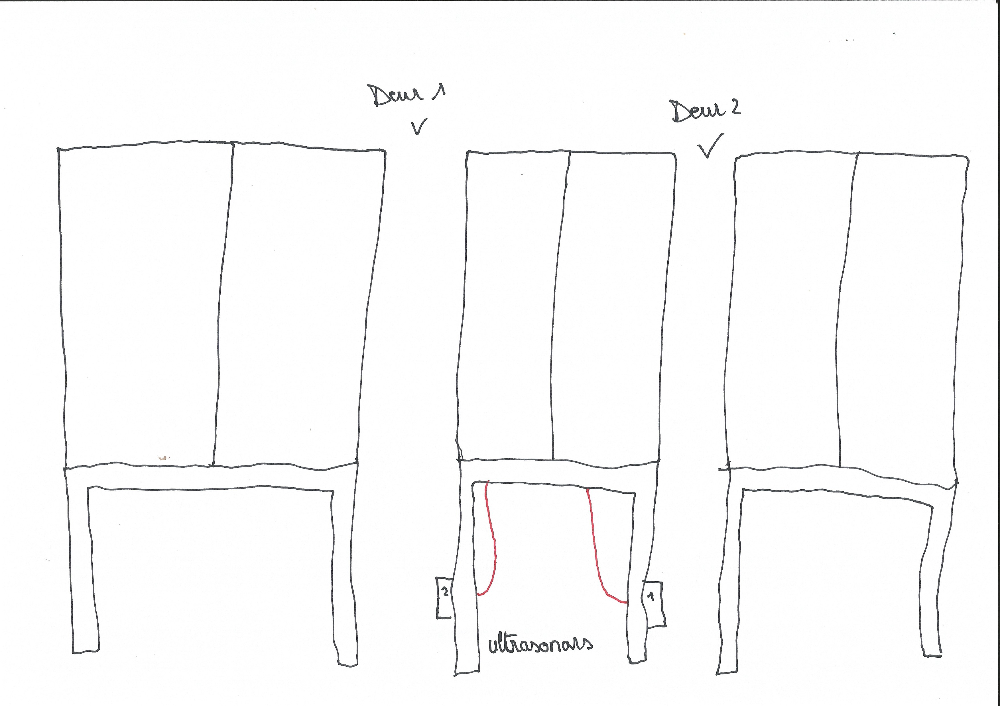
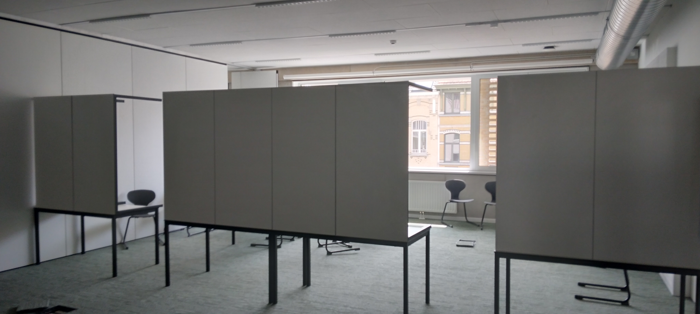
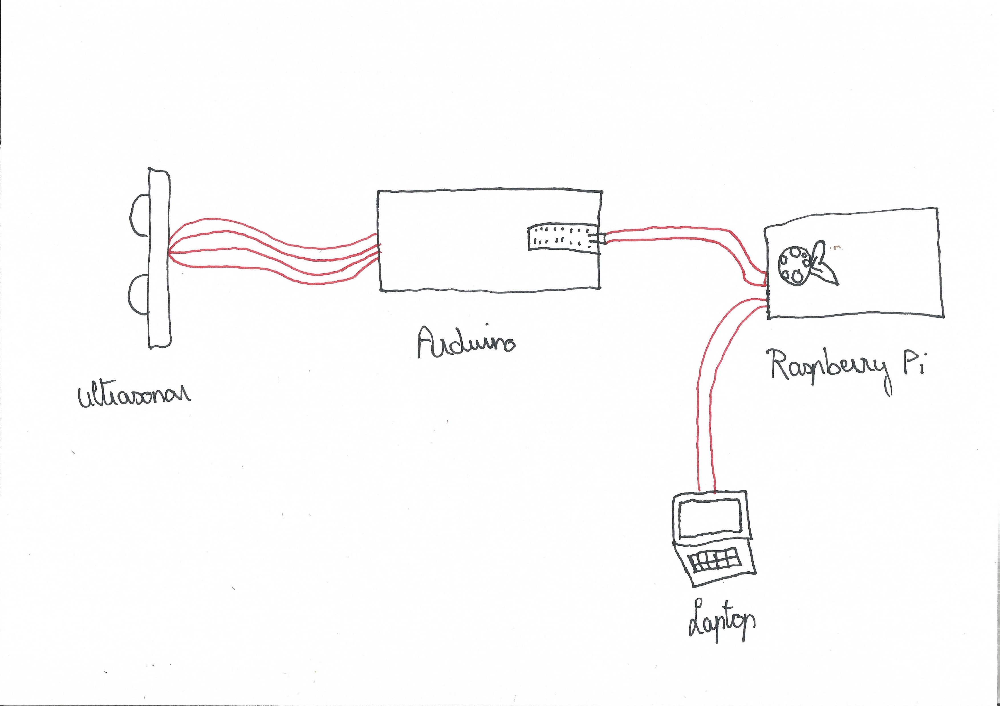
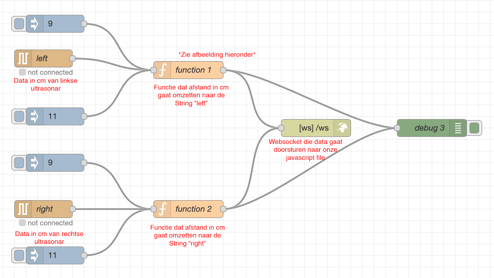
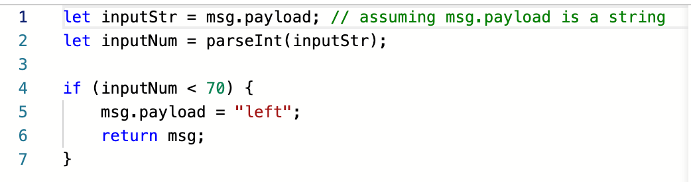
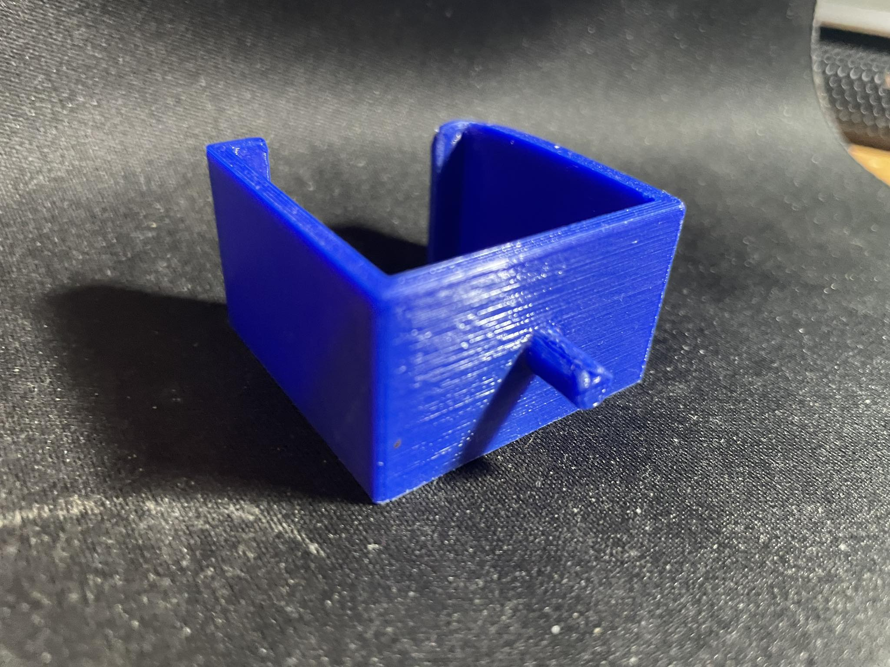

# The Double Door Dilemma

beste mensen, welkom op onze gameshow! Deze README bevat instructables voor onze interactieve game **The Double Door Dilemma.** Gemaakt door TDN (Robbe van Dijck & Jarne Budts). Deze instructies zullen jullie uitleg geven hoe wij onze installatie tot leven hebben gebracht.

## Youtube video TDDD

<a href="http://www.youtube.com/watch?feature=player_embedded&v=YOUTUBE_VIDEO_ID_HERE
" target="_blank"></a>

## Componenten

- Raspberry Pi 4B
- twee arduino's
- twee ultrasonars
- broodbord met toebehorende kabels
- twee beamers
- 18 tafels
- lijmklemmen en koolstofbandjes

## Code taal gebruikt voor onze installatie

- Javascript
- HTML & CSS
- C++

## Omschrijving van het spel

We hebben een interactieve game gemaakt rond met twee deuren.
Door een deur te kiezen en er door te gaan verandert je pad en krijg je
andere keuzes. Er zijn dus ook verschillende eindes voorzien waardoor
het interessant wordt om het spelletje meerdere keren te spelen en alle eindes mee te maken!

## Installatie

Hier volgt de uitleg hoe je ons spel moet installeren

### Stap 1

#### Plaatsen van de tafels

Voor onze installatie hebben wij tafels gebruikt om zo onze twee deuren te maken. Dit gaat natuurlijk op andere manieren, maar wij vonden deze de gamakkelijkste.

Op de eerste foto ziet u een schets van **het vooraanzicht** van onze opstelling

Op de tweede foto ziet u onze tafelschikking staan. Deze opstelling moet nog eens gedaan worden langs de andere kant, **9 tafels** zijn nodig per kant




**TIP!** Hang tussen de middelste 4 tafels doeken zodat mensen de installatie niet kunnen zien!

### Stap 2

#### Het plaatsen van de ultrasonars

Zoals u op de schets ziet hebben we gebruik gemaakt van twee ultrasonars. Eén ultrasonar per deuropening, deze moeten geinstalleerd worden **tussen de twee poten van de middelste tafel.** De kabels van de ultrasensoren kunnen we dan verbinden met onze Raspberry Pi (die in het midden ligt).

### Stap 3

#### Verbinden van ultrasonars naar Raspberry Pi

Zoals u kunt zien op onderste afbeelding is er nog een broodbord met een arduino verbonden tussen de ultrasonar en onze Raspberry Pi, deze arduino moet dan via usb kabel verbonden worden naar de raspberry pi.



### Stap 4

#### Raspberry Pi verbinden met laptop

Omdat ons spel geschreven is in HTML, CSS & Javascript, hebben we een browser nodig dat deze code gaat kunnen runnen. We konden spijtig genoeg ons spel niet laten afspelen op de standaard browser van Raspberry Pi (Chromium) omdat het niet onze TTS functie ondersteunden. We hebben ook andere browsers geprobeert op de Raspberry Pi maar deze werkte allemaal niet.

Daarom raden wij aan om de Raspberry Pi te verbinden met een laptop waarop **Google Chrome** geïnstalleerd is om zo veel errors en fouten te voorkomen

### Stap 5

#### VNC viewer en node-red

Nu moeten we ervoor zorgen dat we input krijgen van onze ultrasonars. We gaan dit doen door **node-red** op te zetten en onze code te laten runnen.

Hoe je VNC viewer kunt gebruiken voor het installeren van node-red vindt u in deze [uitgebreide README](https://github.com/meeplemaker/idl4-cc-rpi-install/tree/main) van **Jonas Baert**

Als node-red helemaal geinstalleerd is en onze code geïmplementeerd is (zie code node-red), kunnen we node-red starten door in de terminal van onze Raspbery Pi `node-red ` te typen. Normaal gezien zou de installatie nu al moeten werken, maar we hebben nog een paar stapjes te gaan

### Stap 6

#### Het installeren van de beamers

We hebben twee beamers nodig, één aan de voorkant waar de speler begint en één aan de andere kant. Deze beamers moeten dan verbonden worden met de laptop. Plaats de beamers zodanig dat het beeld geeft op de twee middelste tafels.

**TIP!** Bevestig de kabels tegen de vloer met ducttape om zo te voorkomen dat mensen strompelen over deze kabels!

### Stap 7

#### Code laten runnen op Chrome

Volgende stap is om onze HTML pagina te laten runnen op de laptop. Normaal gezien als er nu iemand door een deur loopt zou de code moeten werken en zou het spel moeten vorderen.

## Code

Hier volgt wat meer uitleg over de code die we gebruikt hebben voor ons spel. We beginnen bij het begin, en dat is bij onze data van de ultrasensors.

### C++ voor ultrasonars

Voor de data binnen te krijgen van onze ultrasonar hebben we gebruik gemaakt van de codetaal C++ die onze Arduino instructies geeft wat hij moet doen met de data van de ultrasonars. De code die wij gevonden hebben online voor onze ultrasonar maakt gebruik van de NewPing-bibliotheek, die het proces van interactie met ultrasone sensoren vereenvoudigt.

```
void loop() {
  delay(50);                     // Wait 50ms between pings (about 20 pings/sec). 29ms should be the shortest delay between pings.
  long value = sonar.ping_cm();
  //Serial.print("Ping: ");
  //Serial.print(value); // Send ping, get distance in cm and print result (0 = outside set distance range)
  //Serial.println("cm");
  //Serial.print("Ping with moving average: ");
  Serial.print(movingAverage(value));
  Serial.print("\n");
  //Serial.println("cm");
}
```

#### Korte uitleg wat de code juist doet

In de loop()-functie stuurt de code herhaaldelijk een ping van de ultrasonar en ontvangt het bijbehorende echo-signaal om **de afstand te berekenen** in centimeter. Er wordt een bewegend gemiddelde algoritme gebruikt om de metingen te verzachten door het gemiddelde van de laatste 10 metingen te berekenen.

De berekende afstand wordt vervolgens afgedrukt op de **seriële monitor** met behulp van de Serial.print()-functie. De vertraging van 50 milliseconden tussen pings maakt ongeveer 20 pings per seconde mogelijk.

We krijgen dus constant **afstanden in centimeter** binnen van onze ultrasonar. Met deze data kunnen we nu code schrijven om ervoor te zorgen dat ons spel doorgaat **als de afstand van de ultrasonar verandert**. Hiervoor hebben we node-red gebruikt

### Code in node-RED

#### Data naar websocket sturen

Node-RED biedt een **WebSocket-invoer- en uitvoerknooppunt** waarmee je gegevens kunt verzenden en ontvangen met behulp van het WebSocket-protocol. Deze knooppunten maken het eenvoudig om WebSocket-functionaliteit in je flows te integreren.

We gaan dus de data van onze ultrasonar naar een WebSocket sturen die deze data naar onze **Javascript file**
kan transporteren.

**Maar eerst moeten we de data nog omzetten!**

#### Data omzetten naar String

Met de data die we nu krijgen (afstand in cm) zijn we niets voor onze installatie, we moeten alleen weten of er verandering is in die afstand om zo te weten of er iemand langs de sensor passeerd of niet.

Hiervoor hebben we een **kleine functie** geschreven in node-red om zo de data om te zetten naar een String **"left" of "right"**, zo weten we door welke deur juist iemand gelopen is.



#### Uitleg Functie

De functie is eigenlijk zeer simpel: _als de data kleiner is dan hij normaal altijd meet, maakt hij een String "left" of "right" aan (hangt af van welke deur) en stuurt deze String door naar de Websocket_

#### Waarom kleiner als 70?

Dit was de afstand dat hij normaal altijd meet, als er dus iemand passeerd voorbij de sensor gaat die altijd kleiner zijn als 70 waardoor de functie de String gaat versturen naar onze javascript file

**TIP!** Kijk zeker eens na hoeveel dat de afstand is als er **niemand** langs de sensor passeerd, om deze data te bekijken kunt u altijd een _Debug_ aan de node-red file hangen om te zien wat de afstand is! (kijk afbeelding)

### Javascript

Met maar liefst **455 lijntjes aan code** is dit de meest gebruikte taal van ons project. Wij hebben de belangrijkste deeltjes code uit onze file gehaald om hier wat meer uitleg bij te geven

#### Data van ultrasonars in javascript

Nu we de data gelinkt hebben met onze websocket kunnen we aan deze data op onze javascript file. Volgende code is hiervoor nodig om de data in onze javascript file te laden:

```javascript
var wsUri = "ws://" + "192.168.100.1:1880" + "/ws";
window.onload = () => {
  wsConnect();
};
```

Deze code initialiseert een WebSocket-verbinding met het IP-adres "192.168.100.1" en de poort "1880" op een bepaalde Node-RED-server. Wanneer de webpagina wordt geladen (window.onload), wordt de functie wsConnect() aangeroepen om de verbinding tot stand te brengen.

#### Wat doen we nu met deze data?

We krijgen nu de String **"left" of "right"** binnen, maar wat doen we nu met deze data?

We hebben dus verschillende _options_ gemaakt, elke option heeft een paar attributen, hier is een voorbeeld van een option:

```javascript
option1: {
    question:
      "Beste mensen, welkom op onze gameshow! Zie je deze cadeautjes beste speler? 1 persoon kan maar door 1 deur, de rest mag aan één kant blijven wachten, ga ook vlotjes en snel door de deur(ga door linkse deur voor linkse pakje en rechtse deur voor rechtse pakje)",
    nextLeft: "option2",
    nextRight: "option3",
    bg: "./public/img/Gameshow/gameshow_presents_OG.png",
    sound: "./public/sound/gameshow.mp3",
  },
```

Dit is ons **startscherm,** Als we nu links door de deur gaat zal die naar _option2_ gaan, als we door de rechtse gaan naar _option3_ zo veranderd ons spel altijd van **achtergrond (bg)** en speelt er ook altijd **een sound** bij het wandelen door de deur!

We hebben **bijna 45** van deze options voorzien om zo verschillende wegen en verhalen te ervaren!

#### Hoe veranderen de options?

Met deze functie:

```javascript
if (options[currentOption] && options[currentOption].nextLeft) {
        if (msg.data === "left") {
          currentOption = options[currentOption].nextLeft;
          background.style.backgroundImage = `url(${options[currentOption].bg})`;
          content.textContent = options[currentOption].question;}
```

**Als de data "left" is** (dus iemand loopt door de linkse deur) gaat de _currentOption_ veranderen naar de _nextLeft_ van die _currentOption_. Hetzelfde gebeurt ook bij de rechtse kant, deze gaat dan de data van _nextRight_ nemen. Heel simpele functie om een pagina te veranderen zonder van **HTML pagina** te switchen.

**De background** veranderd ook naar de background image link van de _currentOption_ en de tekste van de pagina veranderd ook

#### TTS

Nu ik uitgelegd heb hoe de options veranderen kunnen we het hebben over de _text to speech_ van onze game, hiervoor hebben we **SpeechSynthesisUtterance-interface** voor gebruikt

Het gebruik van de SpeechSynthesisUtterance-interface in JavaScript laat je tekst om zetten in spraak met behulp van de ingebouwde spraaksynthese-functionaliteit van moderne webbrowsers.

Daarom konden we hem niet gebruiken op onze Raspberry Pi omdat SpeechSynthesisUtterance-interface niet ondersteund werd door Chromium (het browser van Raspberry Pi), **op gewone Google Chrome werkt het uistekend goed!**

We kunnen ook **eigenschappen veranderen** van de TTS,

```javascript
speechSynthesis.speak(message);
          }, 5000);
          message.pitch = 2;
          message.volume = 2;
          message.lang = "nl-BE";
          message.rate = 1;
```

Zo hebben we de stem Nederlands (met Vlaamse toets) gemaakt en de hoogte van de mannenstem ook wat verhoogd zodat deze aangenamer werd om naar te luisteren.

Dit waren de voornamelijkste stukjes code van onze game. Als u al de code wilt bekijken kan dat door op deze
[link te klikken!](https://github.com/Djermorr/InteractiveStory/blob/main/interactiveStory/src/script.js)

#### HTML & CSS

We hebben niet veel HTML & CSS code omdat we bijna alles gecodeerd hebben in javascript. U kunt altijd onze CSS code bekijken door op deze [link te klikken!](https://github.com/Djermorr/InteractiveStory/blob/main/interactiveStory/src/styles/styles.css)

## Tips & Tricks!

#### Creatief denken + Gebruik van makerspace

Wij hebben voor onze installatie voldoende gebruik gemaakt van de makerspace, zo hebben we met **een 3d printer** klemmetjes laten maken die rond de poten van de tafels pasten. Tussen deze twee klemmen staken we dan een plank waar onze ultrasonar in gezet werd. Onze plank hebben we ook laten uitsnijden met een lasercutter in de makerspace

